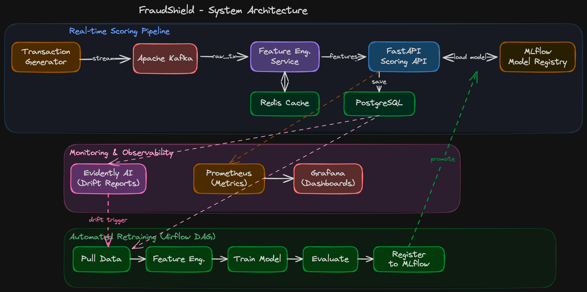

# FraudShield — Real-time Financial Fraud Detection System

A production-grade ML system that detects credit card fraud in real-time.
Not just a model — a complete pipeline: stream ingestion, feature engineering,
model serving, experiment tracking, and automated retraining.

---

## What It Does

Every transaction flows through this system in under 100ms:

```
Transaction → Kafka → Feature Engineering → ML Model → Decision (ALLOW/BLOCK)
                              ↕
                         Redis Cache
```

The system also monitors itself — detecting when the model starts degrading and
triggering an Airflow retraining pipeline automatically.

---

## Architecture



Three zones:
1. **Real-time Scoring** — Kafka stream → feature engineering → FastAPI scoring API
2. **Monitoring** — Evidently AI drift reports, Prometheus metrics, Grafana dashboards
3. **Retraining** — Airflow DAG: pull data → features → train → evaluate → register in MLflow

---

## Tech Stack

| Layer | Tool | Why |
|-------|------|-----|
| Streaming | Apache Kafka | Decouples producer/consumer, message replay on crash |
| Feature cache | Redis | Sub-ms feature lookup (PostgreSQL too slow for <100ms SLA) |
| Experiment tracking | MLflow | Free, self-hosted, model registry with staging/production states |
| Serving | FastAPI | Async, auto-docs, Pydantic validation |
| Orchestration | Apache Airflow | Industry standard for ML retraining pipelines |
| Drift detection | Evidently AI | Purpose-built for ML monitoring, generates HTML reports |
| Metrics | Prometheus + Grafana | Industry standard observability stack |
| Storage | PostgreSQL | Stores predictions + labels for monitoring |
| Everything | Docker Compose | One command to start all 8 services |

---

## Dataset

IEEE-CIS Fraud Detection (Kaggle) — 590k transactions, ~3.5% fraud rate.  
Download: https://www.kaggle.com/c/ieee-fraud-detection/data  
Place files in `data/raw/`.

---

## Quick Start

```bash
# 1. Clone and enter
git clone <repo-url>
cd fraudshield

# 2. Download dataset from Kaggle and place in data/raw/

# 3. Start all services
docker-compose up -d

# 4. Verify services are healthy
docker-compose ps

# 5. Open UIs
# MLflow:    http://localhost:5000
# Airflow:   http://localhost:8080
# Grafana:   http://localhost:3000
# FastAPI:   http://localhost:8000/docs
```

---

## Project Structure

```
fraudshield/
├── docs/               HLD diagram, PRD, tech stack decisions
├── data/
│   ├── raw/            original dataset (never modified)
│   └── processed/      feature-engineered, model-ready data
├── notebooks/          EDA and experiment notebooks
├── src/
│   ├── ingestion/      Kafka producer — simulates transaction stream
│   ├── features/       feature engineering + Redis interaction
│   ├── training/       model training + MLflow logging
│   ├── serving/        FastAPI scoring API
│   ├── monitoring/     Evidently drift reports + alert logic
│   └── orchestration/  Airflow DAG definitions
├── infra/              Docker, Kafka, Grafana, Prometheus configs
├── tests/              unit and integration tests
└── scripts/            setup helpers, data download
```

---

## Performance

| Metric | Target | Achieved |
|--------|--------|----------|
| PR-AUC | > 0.85 | TBD |
| p99 latency | < 100ms | TBD |
| Throughput | > 500 tx/sec | TBD |

---

## Build Status

- [ ] Infrastructure: Docker Compose with all 8 services
- [ ] Data pipeline: feature engineering on IEEE-CIS dataset
- [ ] Model training: XGBoost, LightGBM, Logistic Regression tracked in MLflow
- [ ] Serving: FastAPI /predict endpoint < 100ms
- [ ] Monitoring: Grafana dashboard + Evidently drift reports
- [ ] Retraining: Airflow DAG end-to-end
